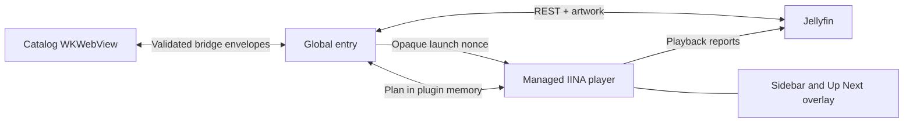

# Architecture

Jellyfin for IINA is a plugin-only Direct Mode client. It does not maintain a local metadata
mirror and does not require a Jellyfin server plugin or native helper.

## Global entry

`packages/plugin/src/global.ts` owns the standalone catalog window, connection metadata,
Keychain token lookup, Quick Connect state, authenticated catalog/artwork requests, playback
negotiation, and the managed-player registry.

The catalog posts a strict `{ operation, requestId, payload }` envelope. The global entry parses
it with the core Zod schema and replies with exactly one `{ operation, requestId, ok, result |
error }` envelope. There is no generic URL fetch operation and no bridge response contains an
access token, authorization header, playback URL, or Quick Connect secret.

Playback uses an opaque `iina-jellyfin://play/<nonce>` URL. The new player asks the global entry
for the corresponding plan over IINA's trusted global/main message channel. Credentials remain
in plugin JavaScript memory and are never encoded into the opaque URL or player label.

## Player entry

`packages/plugin/src/index.ts` installs a `PlayerRuntime` in each IINA player. It intercepts the
opaque launch URL in mpv's `on_load` hook, applies the server-negotiated URL and HTTP headers,
downloads a selected external subtitle into `@tmp`, and then continues loading. After primary
media load succeeds, it resolves that private path and attaches the subtitle.

The player reports start only after `iina.file-loaded`, progress every ten seconds and after
pause/resume/seek, and stopped after completion, replacement, close, failure, or an explicit
stop. Reports are serialized from immutable session snapshots. Generation and load sequence
counters invalidate stale callbacks when the managed player is replaced.

The same player entry owns the contextual sidebar and clickable Up Next overlay. On episode
completion, the global entry asks Jellyfin for Next Up. The player runs the cancelable countdown;
autoplay never silently starts a video re-encode.

## Core package

`packages/core` is independent of IINA and React. It contains runtime contracts, URL and
authorization handling, request builders, the mpv device profile, playback-plan selection,
report payloads, redaction, and the playback state reducer. This keeps the security- and
protocol-sensitive behavior deterministic and unit-testable.

## UI package

`packages/ui` contains three independent Vite entries:

- `catalog`: Connect → Home → Library/Search → Details → Playback.
- `sidebar`: Now Playing, playback context, Up Next, and reopen-library action.
- `overlay`: compact Up Next countdown with Play Now and Cancel.

When not hosted by IINA, the UI uses a deterministic mock bridge. The production bundle talks
only through IINA webview messages.
